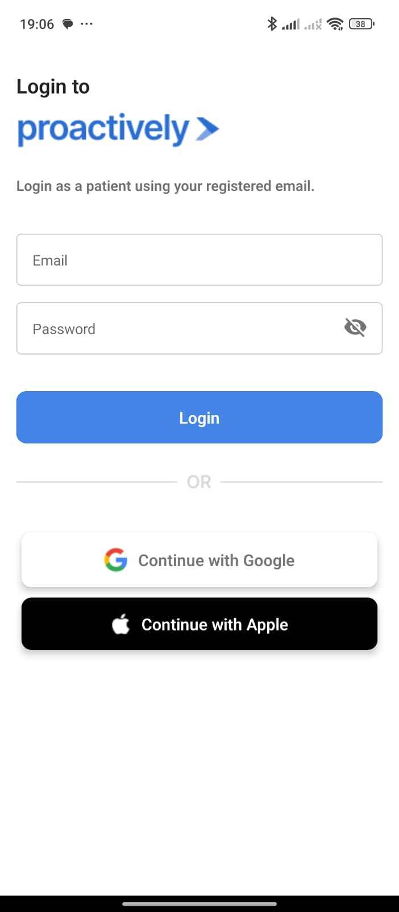
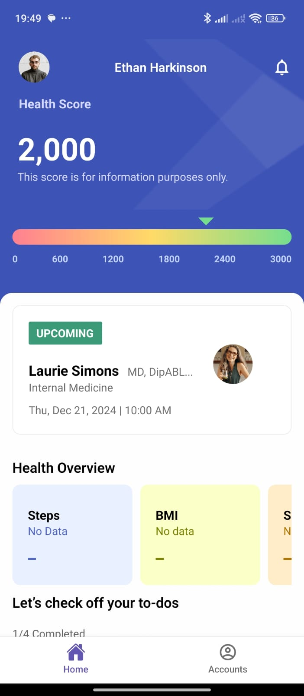

# Proactively Application

  

## Overview

Proactively is a React Native application designed to provide users with an interactive and dynamic mobile experience. The app incorporates notifications, animations, and custom navigation features, ensuring a seamless and engaging user experience.

The application includes functionality such as user authentication, health tracking inputs, and dynamic background animations.

## ✨ Features

- Push Notifications
- Dynamic Background Animation:
- User Authentication
- Tab-Based Navigation
- Health Data Inputs
- Local Data management for Health data and to-do lists
- Responsive Design
- Can see Upcoming Appointment Details and Join Directly through embedded meeting link
- Can see Upcoming Appointment Details and Join Directly through embedded meeting link
- Logout Functionality

## ▶️ Tech Stack

**Development Platform:** Visual Studio Code

**Development:** React Native, Typscript

**Navigation:** React Navigation

**Notifications**: Expo Notifications API, Postman (for Testing)

**Animation**: React Native Animated API

**State Management**: Context API

## ✅ Usage

**1.** Launch the application.

**2.** Register or log in with your account.

**3.** Navigate through various features such as health data inputs, appointments, and more.

**4.** Enable notifications to receive reminders and updates.

## Screenshots

## Demo

https://drive.google.com/file/d/1yvLSC7aBTvme7wZ2eq1zfQYlV2NNoNbb/view?usp=sharing
